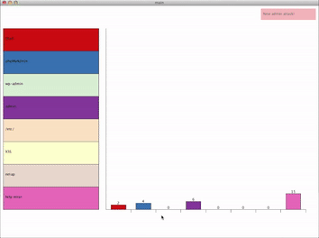

# Project Description

This program aims to expedite and facilitate the network monitoring process by applying visualization and auditory techniques. In this first implementation, visualization serves to place the analyst in the contextual narrative of what requests have been made on the network. Alongside it, the sonification of the program capitalizes on our natural ability to filter out and notice specific sounds out of the many, ultimately allowing passive monitoring of network traffic. Smarter triggering methods, according to the severity-frequency formula, pre-filters incidents so that analysts can ignore the more harmless incidents and be alerted to the more suspicious. Moreover, this triggering method also works against the high false positivity rate endemic to security work and lessens the number of distractions analysts as programmers experience on their day-to-day jobs.

Completed as my final research project for the Tufts course: Security Systems with Professor Ming Chow.

To view the code or run the application as it currently stands, visit the original [repo](https://github.com/bdebut01/VizSec/tree/master/Project). 

Note: was written on Processing in Java so a familiar build system would be needed to run code.

