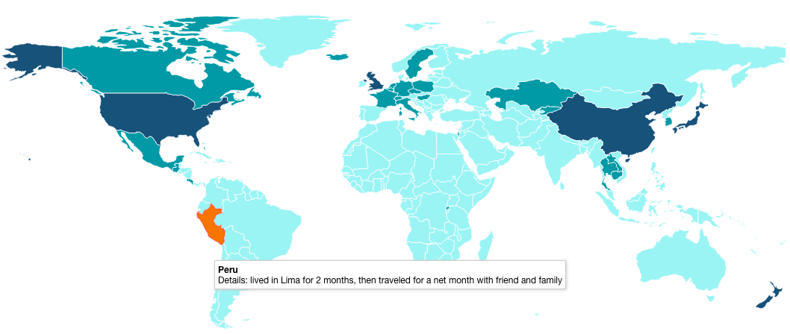

# Directory information

## d3

Description: the root d3 folder

## globe

#### Description 

Presently, a static rendering of the earth using a d3.geo orthographic projection. The data is from [Natural Earth Data](https://naturalearthdata.com), was obtained as a shapefile, converted to GeoJSON, then to [TopoJSON](https://github.com/topojson/topojson) to reduce filesize. 

#### Future 

Project countries visited in different colors, allow world rotation, interactivity with travel details when hovering over country

## travels

#### Description 

The first fully working implementation of the travel map, uses [Datamaps](https://datamaps.github.io/) rather than downloading and converting file myself. Hovering over country displays basic travel details.

#### Future 

Retired this one, focusing on globe/travel-new

Sample: 

## travel-new

#### Description

Also using d3.geo and downloaded data from Natural Earth Data (see above), but as a non-globe [geoKavrayskiy7](https://github.com/d3/d3-geo-projection#geoKavrayskiy7) projection.

#### Future

Implement a chronological slider that updates the map to reflect countries visited by that point in time, interactivity similar to the `/travels`project.